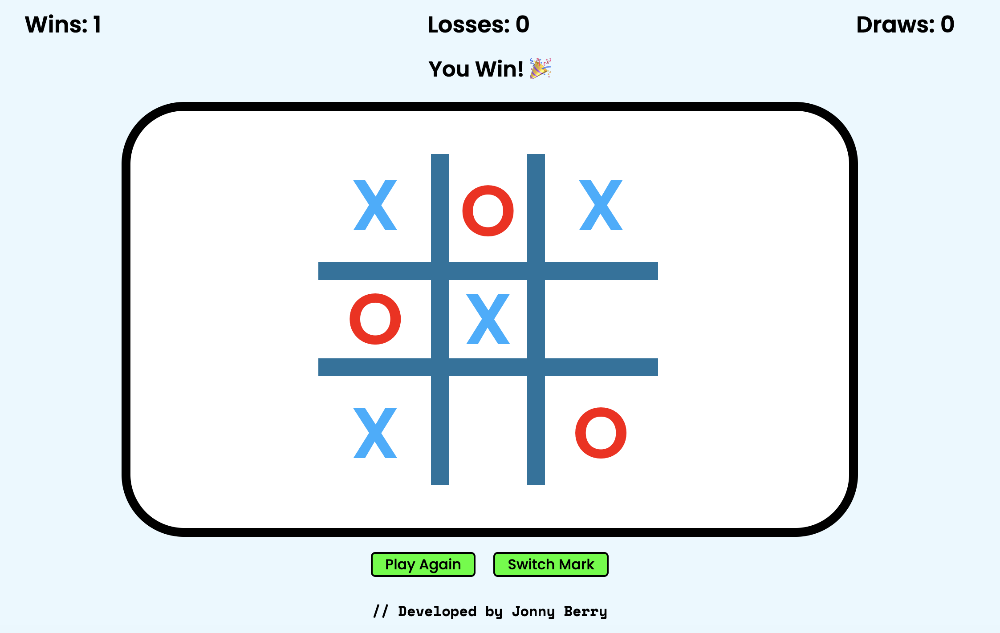

# JavaScript Tic-Tac-Toe
This is a Tic-Tac-Toe game I built while learning about factory functions and modules. It features a challenging NPC opponent, keeps track of the user's game stats, and allows them to choose their mark.

### Technologies Used
- HTML5
- CSS3
- JavaScript (ES6+)

### [Play Here](https://jonny-berry.github.io/tic-tac-toe/)

---

---

### Connect With Me
- [GitHub](https://github.com/jonny-berry)
- [Twitter / X](https://x.com/jonnyDevvs)
- [jonnydevvs@gmail.com](mailto:jonnydevvs@gmail.com)